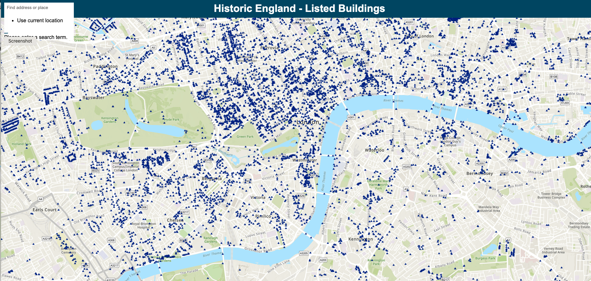

# Historic England Listed Buildings Web Application

## Overview

This web application provides an interactive map displaying listed buildings in England. It leverages the ArcGIS API for JavaScript to visualize and query heritage site data.

## Features

- View a map of listed buildings in England.
- Search for specific buildings using the search widget.
- Access detailed information about each listed building through pop-up templates.
- Responsive design for optimal user experience on various devices.

## Usage

1. Clone this repository to your local machine.
2. Open `index.html` in a web browser to run the application.

## Dependencies

- ArcGIS API for JavaScript (version 4.21)

## Installation

No installation is required. Simply open `index.html` in a web browser.

## Contributing

Pull requests are welcome. For major changes, please open an issue first to discuss what you would like to change.

## License

[MIT](LICENSE)

## Credits

- [Historic England](https://historicengland.org.uk) - Data source and inspiration.

## Support

For questions or issues, please [open an issue](../../issues).
